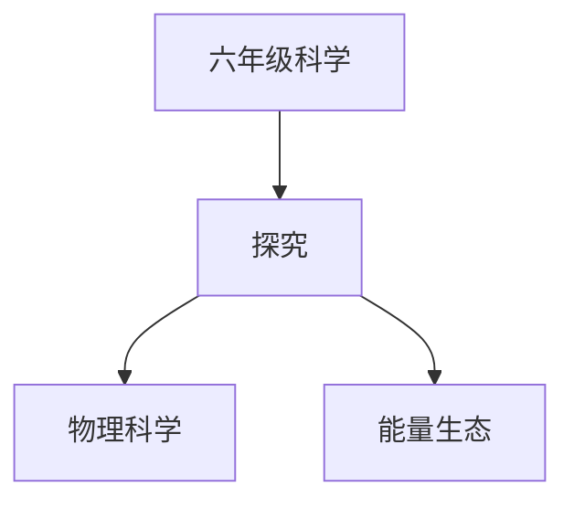

# 六年级科学知识结构

## 知识体系总览

## 知识点列表

| 序号 | 知识点 | 核心目标 |
|------|--------|---------|
| 1 | [简单机械](./简单机械) | 了解杠杆、滑轮、斜面等简单机械原理 |
| 2 | [能量的转化](./能量的转化) | 认识能量的不同形式及其相互转化 |
| 3 | [生态系统](./生态系统) | 了解食物链、食物网和生态平衡 |

## 学习目标

- 了解杠杆、滑轮、斜面等简单机械原理
- 认识能量的不同形式及其相互转化
- 了解食物链、食物网和生态平衡
