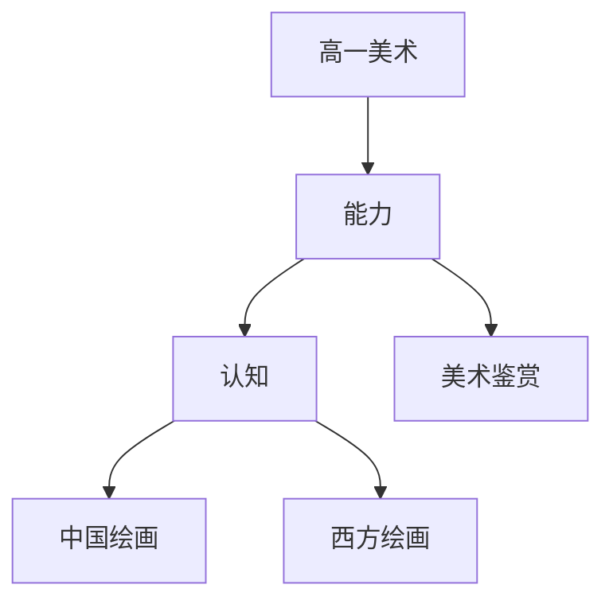

# 高一美术知识结构

## 知识体系总览

## 知识点列表

| 序号 | 知识点 | 核心目标 |
|------|--------|---------|
| 1 | [美术鉴赏基础](./美术鉴赏基础) | 了解美术语言和鉴赏方法 |
| 2 | [中国绘画](./中国绘画) | 了解中国画的分类和发展历程 |
| 3 | [西方绘画](./西方绘画) | 了解西方绘画的主要流派和代表作品 |

## 学习目标

- 了解美术语言和鉴赏方法
- 了解中国画的分类和发展历程
- 了解西方绘画的主要流派和代表作品
