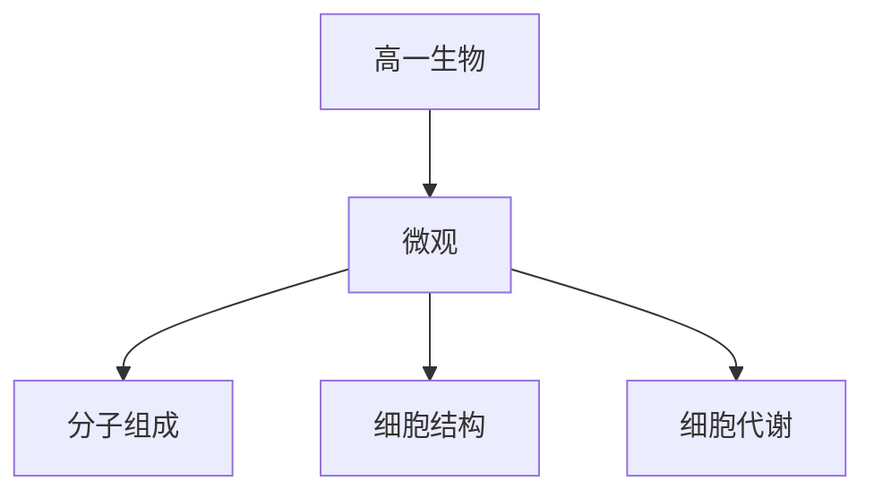

# 高一生物知识结构

## 知识体系总览

## 知识点列表

| 序号 | 知识点 | 核心目标 |
|------|--------|---------|
| 1 | [细胞的分子组成](./细胞的分子组成) | 了解蛋白质核酸糖类脂质的结构和功能 |
| 2 | [细胞的结构与功能](./细胞的结构与功能) | 掌握细胞膜细胞器细胞核的结构和功能 |
| 3 | [细胞代谢](./细胞代谢) | 理解酶的特性、ATP、光合作用和呼吸作用 |

## 学习目标

- 了解蛋白质核酸糖类脂质的结构和功能
- 掌握细胞膜细胞器细胞核的结构和功能
- 理解酶的特性、ATP、光合作用和呼吸作用
