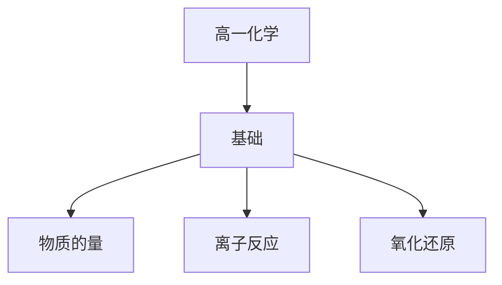

# 高一化学知识结构

## 知识体系总览

## 知识点列表

| 序号 | 知识点 | 核心目标 |
|------|--------|---------|
| 1 | [物质的量](./物质的量) | 掌握物质的量、摩尔质量、气体摩尔体积 |
| 2 | [离子反应](./离子反应) | 理解电解质和非电解质，掌握离子方程式的书写 |
| 3 | [氧化还原反应](./氧化还原反应) | 掌握氧化还原反应的概念和配平 |

## 学习目标

- 掌握物质的量、摩尔质量、气体摩尔体积
- 理解电解质和非电解质，掌握离子方程式的书写
- 掌握氧化还原反应的概念和配平
