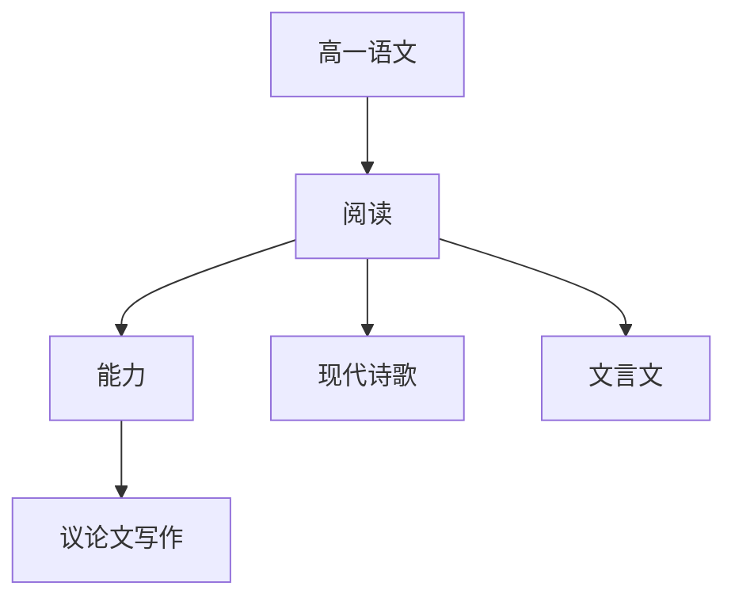

# 高一语文知识结构

## 知识体系总览

## 知识点列表

| 序号 | 知识点 | 核心目标 |
|------|--------|---------|
| 1 | [现代诗歌](./现代诗歌) | 学习《沁园春·长沙》《再别康桥》等名篇 |
| 2 | [文言文阅读](./文言文阅读) | 阅读《劝学》《师说》等经典论说文 |
| 3 | [议论文写作](./议论文写作) | 掌握议论文三要素和论证方法 |
| 4 | [整本书阅读](./整本书阅读) | 阅读《乡土中国》或《红楼梦》 |

## 学习目标

- 学习《沁园春·长沙》《再别康桥》等名篇
- 阅读《劝学》《师说》等经典论说文
- 掌握议论文三要素和论证方法
- 阅读《乡土中国》或《红楼梦》
