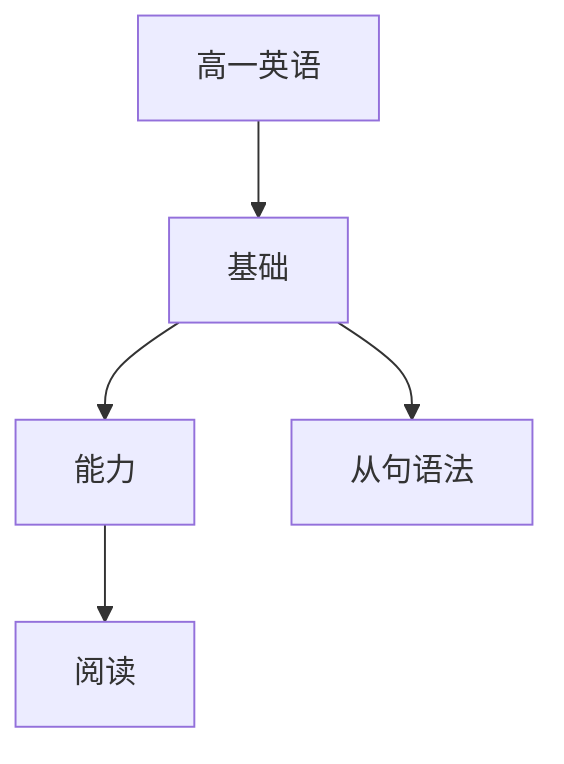

# 高一英语知识结构

## 知识体系总览

## 知识点列表

| 序号 | 知识点 | 核心目标 |
|------|--------|---------|
| 1 | [定语从句](./定语从句) | 掌握关系代词和关系副词的用法 |
| 2 | [名词性从句](./名词性从句) | 掌握主宾表同位语从句 |
| 3 | [阅读理解](./阅读理解) | 阅读200词左右的文章，进行推理判断 |

## 学习目标

- 掌握关系代词和关系副词的用法
- 掌握主宾表同位语从句
- 阅读200词左右的文章，进行推理判断
