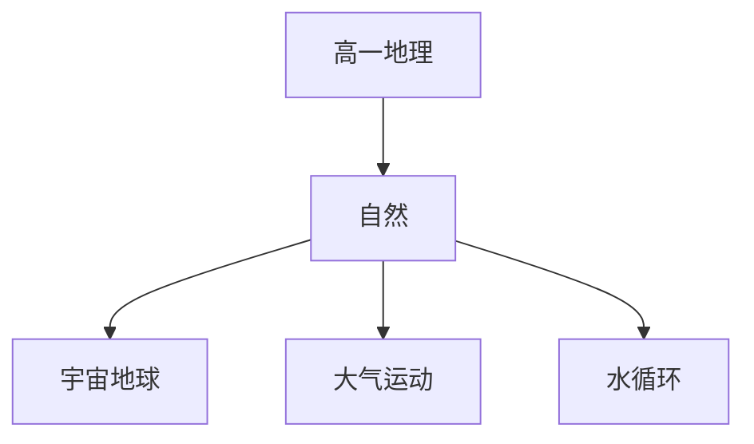

# 高一地理知识结构

## 知识体系总览

## 知识点列表

| 序号 | 知识点 | 核心目标 |
|------|--------|---------|
| 1 | [宇宙中的地球](./宇宙中的地球) | 了解地球的宇宙环境和太阳对地球的影响 |
| 2 | [大气运动](./大气运动) | 理解大气受热过程、热力环流和风 |
| 3 | [水循环](./水循环) | 理解水循环的过程和洋流 |

## 学习目标

- 了解地球的宇宙环境和太阳对地球的影响
- 理解大气受热过程、热力环流和风
- 理解水循环的过程和洋流
