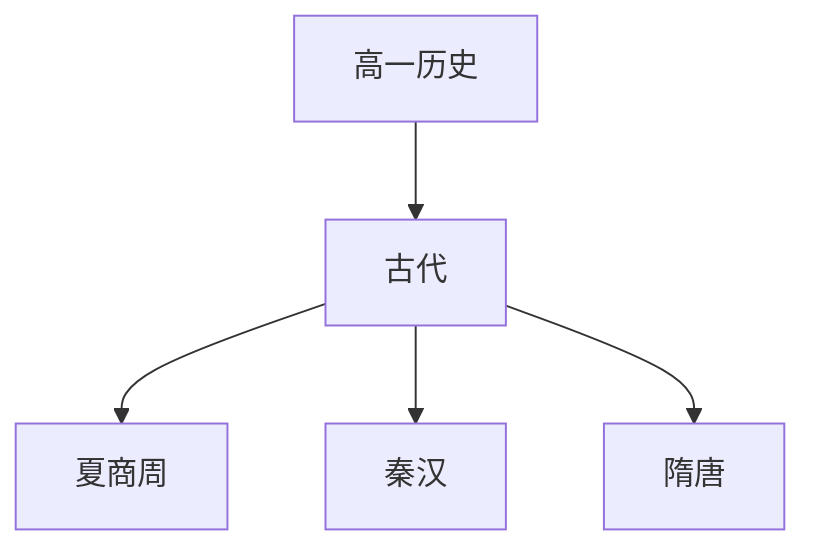

# 高一历史知识结构

## 知识体系总览

## 知识点列表

| 序号 | 知识点 | 核心目标 |
|------|--------|---------|
| 1 | [夏商周文明](./夏商周文明) | 了解早期国家的形成和制度演变 |
| 2 | [秦汉大一统](./秦汉大一统) | 了解秦朝的统一和汉朝的强盛 |
| 3 | [三国至隋唐](./三国至隋唐) | 了解民族交融和隋唐盛世 |

## 学习目标

- 了解早期国家的形成和制度演变
- 了解秦朝的统一和汉朝的强盛
- 了解民族交融和隋唐盛世
