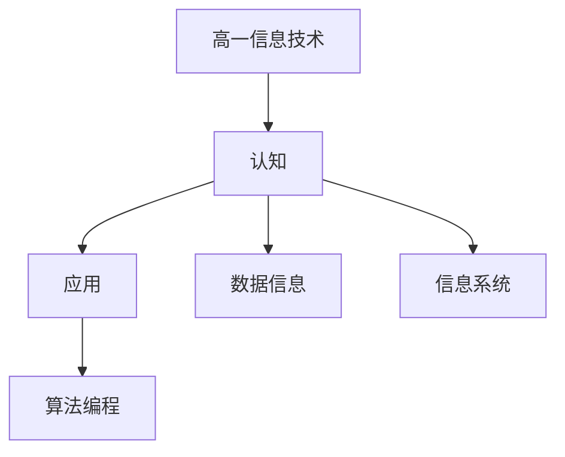

# 高一信息技术知识结构

## 知识体系总览

## 知识点列表

| 序号 | 知识点 | 核心目标 |
|------|--------|---------|
| 1 | [数据与信息](./数据与信息) | 理解数据、信息与知识的关系 |
| 2 | [算法与程序设计](./算法与程序设计) | 学习Python基础语法和程序设计思想 |
| 3 | [信息系统](./信息系统) | 了解信息系统的组成和功能 |

## 学习目标

- 理解数据、信息与知识的关系
- 学习Python基础语法和程序设计思想
- 了解信息系统的组成和功能
