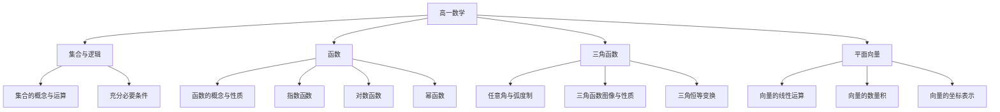

# 高一数学知识结构

## 知识体系总览

## 知识点列表

| 序号 | 知识点 | 核心目标 |
|------|--------|---------|
| 1 | [集合与函数](./集合与函数) | 掌握集合运算和基本初等函数 |
| 2 | [三角函数](./三角函数) | 掌握三角函数的图像、性质与变换 |
| 3 | [平面向量](./平面向量) | 掌握向量的运算和坐标表示 |

## 学习目标

- 理解集合语言，掌握函数的基本性质
- 掌握三角函数和三角恒等变换
- 掌握平面向量的运算和应用