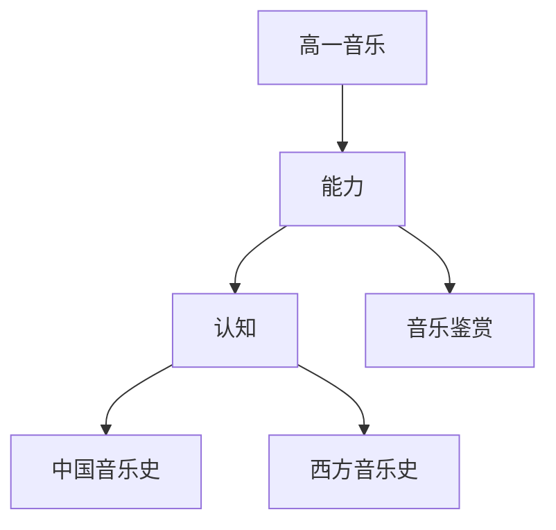

# 高一音乐知识结构

## 知识体系总览

## 知识点列表

| 序号 | 知识点 | 核心目标 |
|------|--------|---------|
| 1 | [音乐鉴赏基础](./音乐鉴赏基础) | 了解音乐的基本要素和鉴赏方法 |
| 2 | [中国音乐史](./中国音乐史) | 了解中国古代和近现代音乐发展 |
| 3 | [西方音乐史](./西方音乐史) | 了解巴洛克古典浪漫主义音乐 |

## 学习目标

- 了解音乐的基本要素和鉴赏方法
- 了解中国古代和近现代音乐发展
- 了解巴洛克古典浪漫主义音乐
