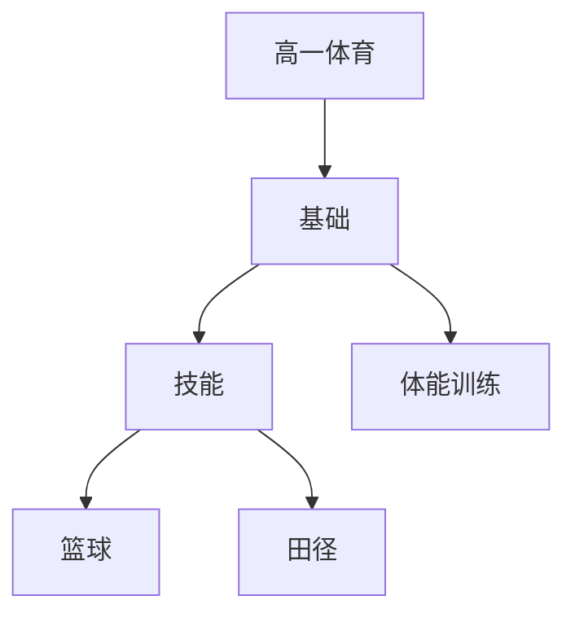

# 高一体育知识结构

## 知识体系总览

## 知识点列表

| 序号 | 知识点 | 核心目标 |
|------|--------|---------|
| 1 | [体能训练](./体能训练) | 掌握力量速度耐力等体能训练方法 |
| 2 | [篮球战术](./篮球战术) | 学习快攻、联防等基本战术配合 |
| 3 | [田径技术](./田径技术) | 掌握短跑、跳远、铅球等田径技术 |

## 学习目标

- 掌握力量速度耐力等体能训练方法
- 学习快攻、联防等基本战术配合
- 掌握短跑、跳远、铅球等田径技术
