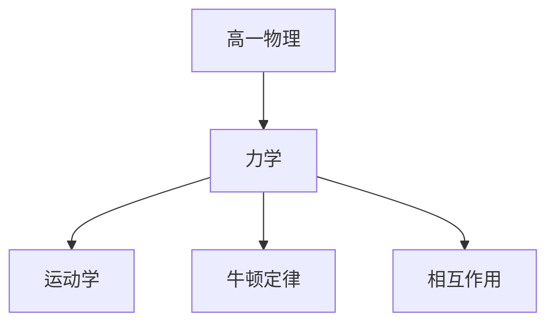

# 高一物理知识结构

## 知识体系总览

## 知识点列表

| 序号 | 知识点 | 核心目标 |
|------|--------|---------|
| 1 | [运动的描述](./运动的描述) | 掌握质点、位移、速度、加速度的概念 |
| 2 | [匀变速直线运动](./匀变速直线运动) | 掌握匀变速运动的三大公式和图像 |
| 3 | [牛顿运动定律](./牛顿运动定律) | 掌握牛顿三定律及其应用 |
| 4 | [相互作用](./相互作用) | 理解重力、弹力、摩擦力及其合成与分解 |

## 学习目标

- 掌握质点、位移、速度、加速度的概念
- 掌握匀变速运动的三大公式和图像
- 掌握牛顿三定律及其应用
- 理解重力、弹力、摩擦力及其合成与分解
