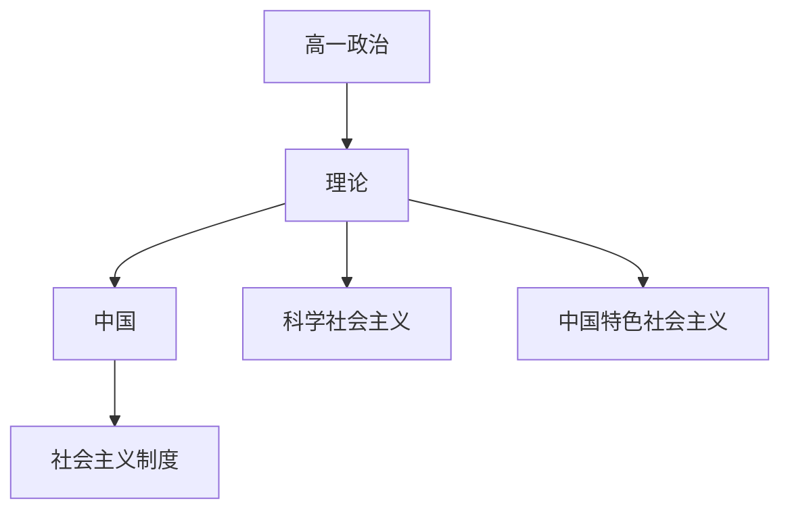

# 高一政治知识结构

## 知识体系总览

## 知识点列表

| 序号 | 知识点 | 核心目标 |
|------|--------|---------|
| 1 | [社会主义从空想到科学](./社会主义从空想到科学) | 了解科学社会主义产生的历史条件 |
| 2 | [社会主义制度在中国](./社会主义制度在中国) | 理解只有社会主义才能救中国 |
| 3 | [中国特色社会主义](./中国特色社会主义) | 理解改革开放和中国特色社会主义道路 |

## 学习目标

- 了解科学社会主义产生的历史条件
- 理解只有社会主义才能救中国
- 理解改革开放和中国特色社会主义道路
