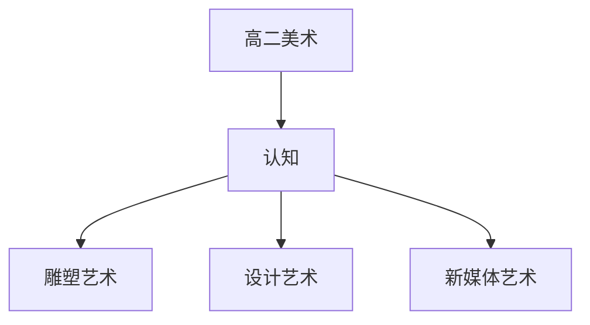

# 高二美术知识结构

## 知识体系总览

## 知识点列表

| 序号 | 知识点 | 核心目标 |
|------|--------|---------|
| 1 | [雕塑艺术](./雕塑艺术) | 了解中外雕塑艺术的发展和代表作品 |
| 2 | [设计艺术](./设计艺术) | 了解工业设计环境设计等现代设计 |
| 3 | [新媒体艺术](./新媒体艺术) | 了解摄影数字艺术等新媒体艺术形式 |

## 学习目标

- 了解中外雕塑艺术的发展和代表作品
- 了解工业设计环境设计等现代设计
- 了解摄影数字艺术等新媒体艺术形式
