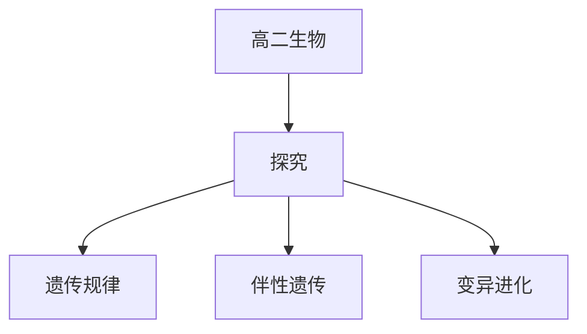

# 高二生物知识结构

## 知识体系总览

## 知识点列表

| 序号 | 知识点 | 核心目标 |
|------|--------|---------|
| 1 | [遗传的基本规律](./遗传的基本规律) | 掌握孟德尔遗传定律和基因的分离与自由组合 |
| 2 | [伴性遗传](./伴性遗传) | 理解伴性遗传的特点和规律 |
| 3 | [生物的变异与进化](./生物的变异与进化) | 了解基因突变基因重组和现代生物进化理论 |

## 学习目标

- 掌握孟德尔遗传定律和基因的分离与自由组合
- 理解伴性遗传的特点和规律
- 了解基因突变基因重组和现代生物进化理论
