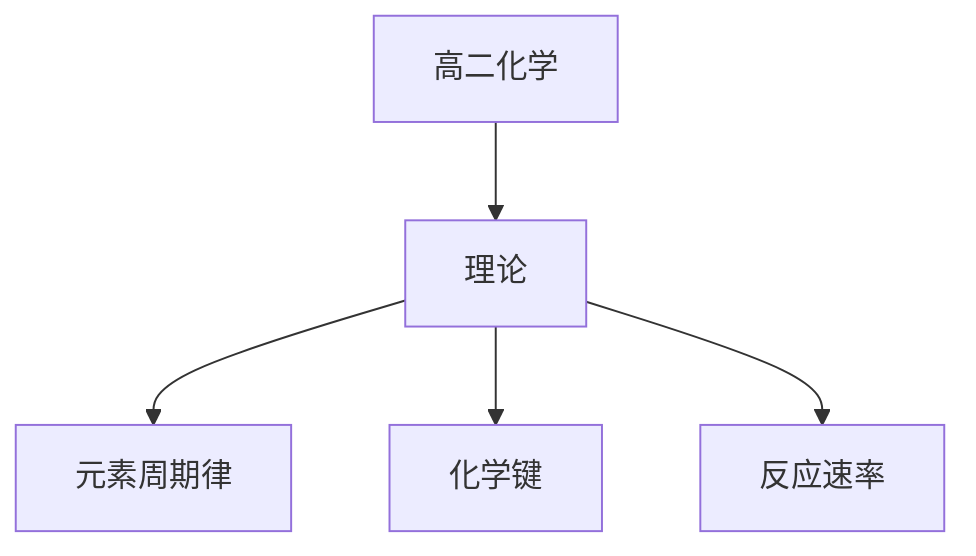

# 高二化学知识结构

## 知识体系总览

## 知识点列表

| 序号 | 知识点 | 核心目标 |
|------|--------|---------|
| 1 | [元素周期律](./元素周期律) | 掌握元素周期表的结构和周期律 |
| 2 | [化学键](./化学键) | 理解离子键共价键分子间作用力 |
| 3 | [化学反应速率与平衡](./化学反应速率与平衡) | 理解反应速率的影响因素和化学平衡移动 |

## 学习目标

- 掌握元素周期表的结构和周期律
- 理解离子键共价键分子间作用力
- 理解反应速率的影响因素和化学平衡移动
