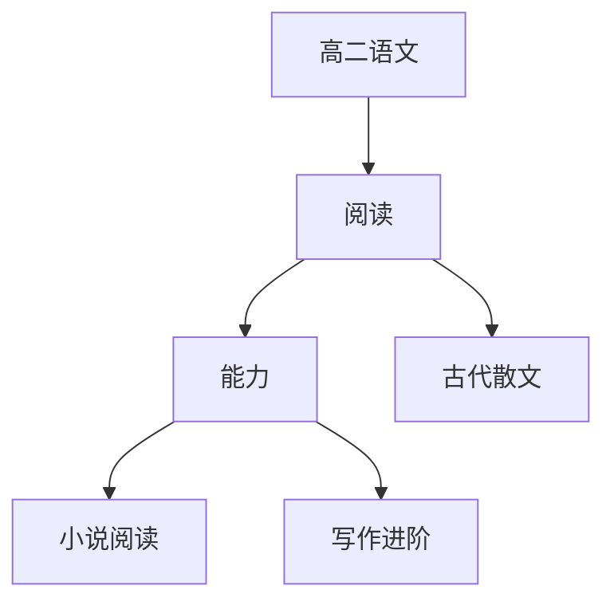

# 高二语文知识结构

## 知识体系总览

## 知识点列表

| 序号 | 知识点 | 核心目标 |
|------|--------|---------|
| 1 | [古代散文](./古代散文) | 阅读《逍遥游》《陈情表》等经典散文 |
| 2 | [小说阅读](./小说阅读) | 学习小说的人物情节环境分析 |
| 3 | [写作进阶](./写作进阶) | 掌握议论文的升格技巧和素材运用 |
| 4 | [整本书阅读](./整本书阅读) | 阅读《红楼梦》或《边城》等 |

## 学习目标

- 阅读《逍遥游》《陈情表》等经典散文
- 学习小说的人物情节环境分析
- 掌握议论文的升格技巧和素材运用
- 阅读《红楼梦》或《边城》等
