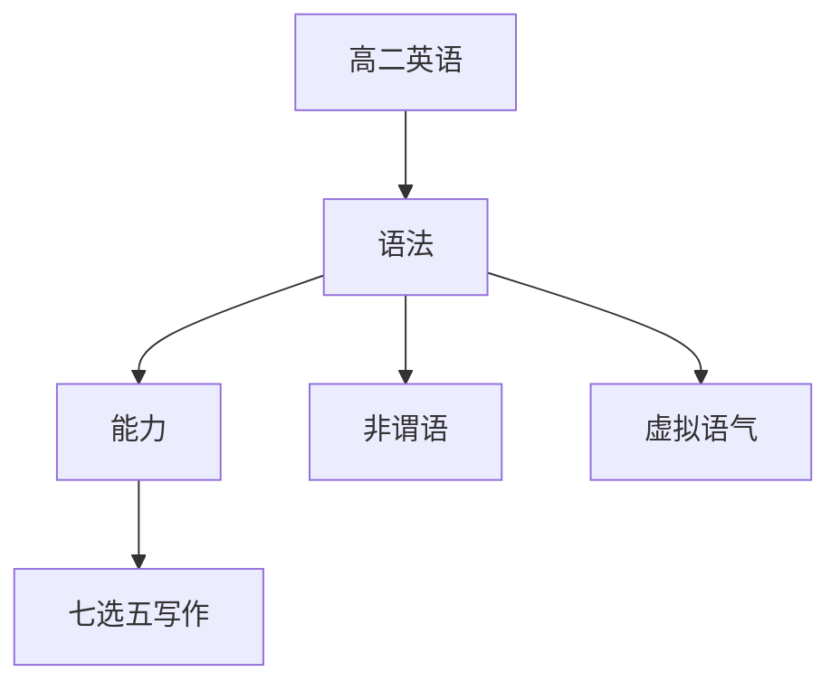

# 高二英语知识结构

## 知识体系总览

## 知识点列表

| 序号 | 知识点 | 核心目标 |
|------|--------|---------|
| 1 | [非谓语动词](./非谓语动词) | 掌握不定式、动名词、分词的用法 |
| 2 | [虚拟语气](./虚拟语气) | 掌握虚拟语气的各种形式 |
| 3 | [七选五与写作](./七选五与写作) | 掌握七选五解题技巧和应用文写作 |

## 学习目标

- 掌握不定式、动名词、分词的用法
- 掌握虚拟语气的各种形式
- 掌握七选五解题技巧和应用文写作
