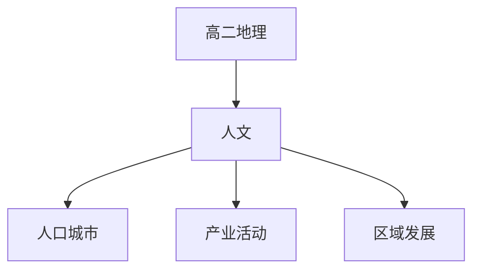

# 高二地理知识结构

## 知识体系总览

## 知识点列表

| 序号 | 知识点 | 核心目标 |
|------|--------|---------|
| 1 | [人口与城市](./人口与城市) | 了解人口增长模式和城市化进程 |
| 2 | [产业活动](./产业活动) | 了解农业工业交通运输的区位因素 |
| 3 | [区域发展](./区域发展) | 了解区域差异和可持续发展策略 |

## 学习目标

- 了解人口增长模式和城市化进程
- 了解农业工业交通运输的区位因素
- 了解区域差异和可持续发展策略
