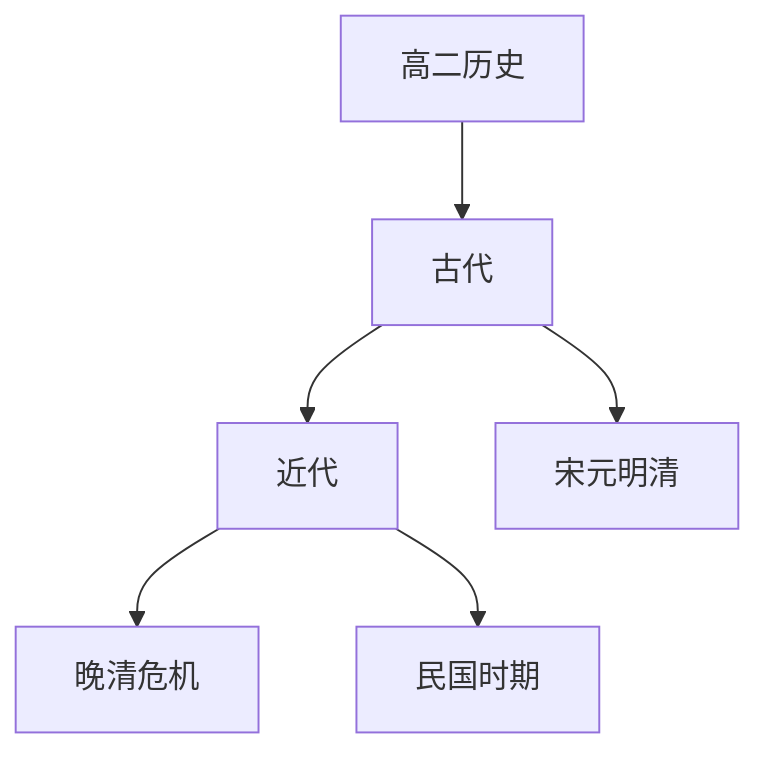

# 高二历史知识结构

## 知识体系总览

## 知识点列表

| 序号 | 知识点 | 核心目标 |
|------|--------|---------|
| 1 | [宋元明清](./宋元明清) | 了解宋元经济繁荣和明清社会变迁 |
| 2 | [晚清危机与变革](./晚清危机与变革) | 了解鸦片战争后的社会危机和救亡图存 |
| 3 | [民国时期](./民国时期) | 了解辛亥革命北洋军阀和新民主主义革命 |

## 学习目标

- 了解宋元经济繁荣和明清社会变迁
- 了解鸦片战争后的社会危机和救亡图存
- 了解辛亥革命北洋军阀和新民主主义革命
