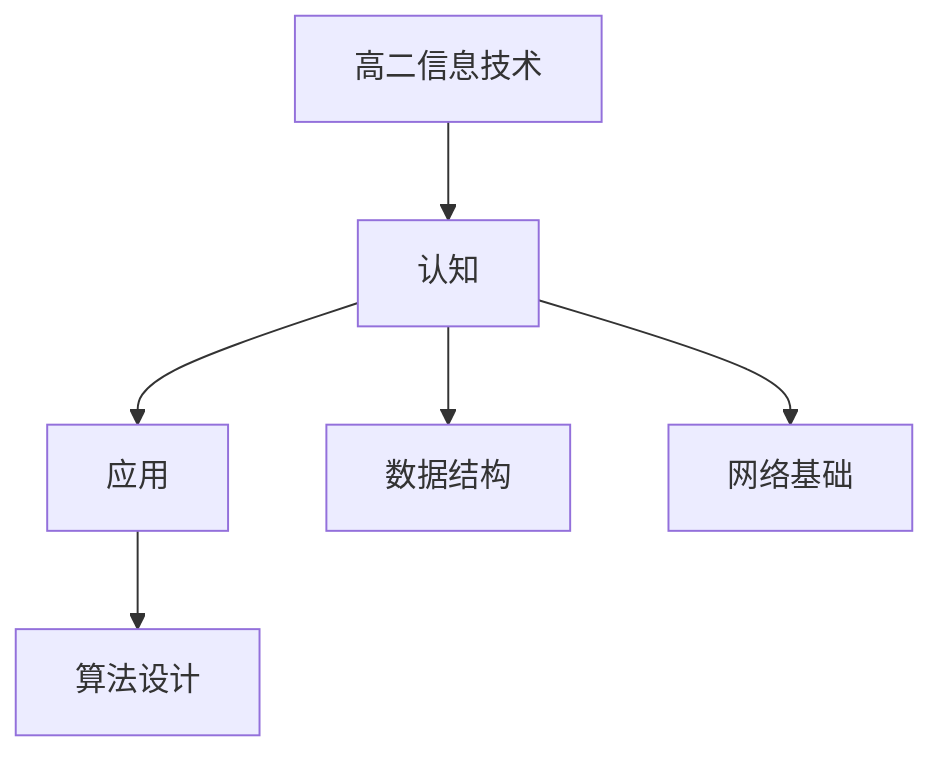

# 高二信息技术知识结构

## 知识体系总览

## 知识点列表

| 序号 | 知识点 | 核心目标 |
|------|--------|---------|
| 1 | [数据结构](./数据结构) | 了解线性表栈队列树的基本概念 |
| 2 | [算法设计](./算法设计) | 学习排序、查找等基本算法 |
| 3 | [网络基础](./网络基础) | 了解网络协议IP地址和域名系统 |

## 学习目标

- 了解线性表栈队列树的基本概念
- 学习排序、查找等基本算法
- 了解网络协议IP地址和域名系统
