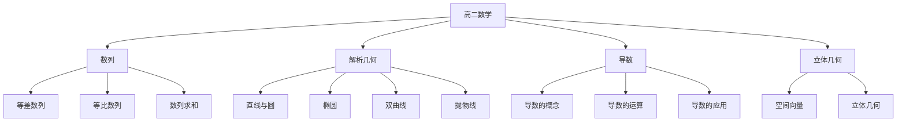

# 高二数学知识结构

## 知识体系总览

## 知识点列表

| 序号 | 知识点 | 核心目标 |
|------|--------|---------|
| 1 | [数列](./数列) | 掌握等差、等比数列及求和 |
| 2 | [圆锥曲线](./圆锥曲线) | 掌握椭圆、双曲线、抛物线 |
| 3 | [导数](./导数) | 掌握导数运算和单调性极值应用 |

## 学习目标

- 掌握数列的通项公式和求和公式
- 掌握圆锥曲线的标准方程和几何性质
- 理解导数概念，掌握导数的应用