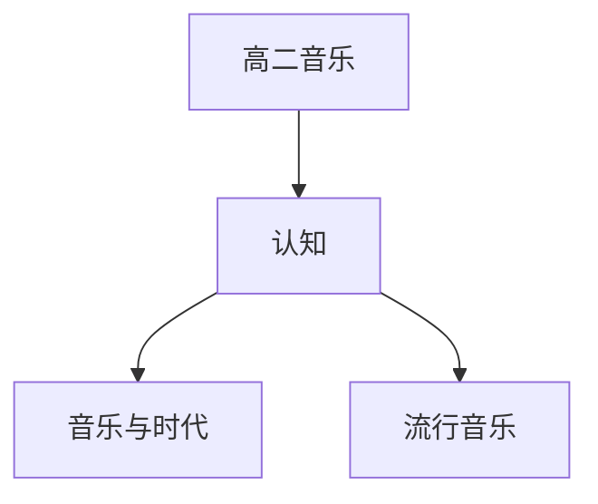

# 高二音乐知识结构

## 知识体系总览

## 知识点列表

| 序号 | 知识点 | 核心目标 |
|------|--------|---------|
| 1 | [音乐与时代](./音乐与时代) | 了解音乐与政治经济文化的关系 |
| 2 | [流行音乐](./流行音乐) | 了解流行音乐的发展和代表类型 |

## 学习目标

- 了解音乐与政治经济文化的关系
- 了解流行音乐的发展和代表类型
