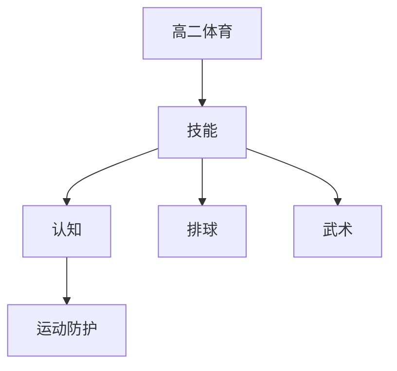

# 高二体育知识结构

## 知识体系总览

## 知识点列表

| 序号 | 知识点 | 核心目标 |
|------|--------|---------|
| 1 | [排球技术](./排球技术) | 掌握发球垫球传球扣球综合技术 |
| 2 | [武术进阶](./武术进阶) | 学习太极拳或长拳规定套路 |
| 3 | [运动损伤与防护](./运动损伤与防护) | 了解常见运动损伤的预防和处理 |

## 学习目标

- 掌握发球垫球传球扣球综合技术
- 学习太极拳或长拳规定套路
- 了解常见运动损伤的预防和处理
