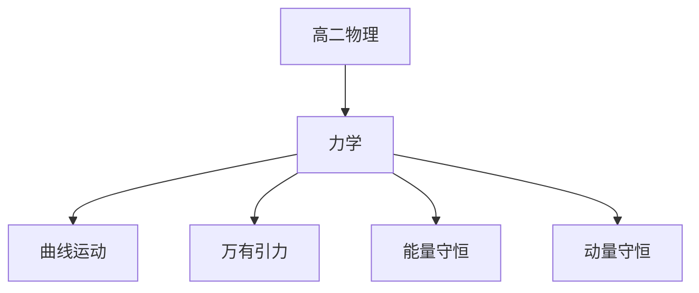

# 高二物理知识结构

## 知识体系总览

## 知识点列表

| 序号 | 知识点 | 核心目标 |
|------|--------|---------|
| 1 | [曲线运动](./曲线运动) | 掌握平抛运动和圆周运动规律 |
| 2 | [万有引力](./万有引力) | 掌握万有引力定律和天体运动 |
| 3 | [机械能守恒](./机械能守恒) | 掌握功功率动能定理和机械能守恒 |
| 4 | [动量守恒](./动量守恒) | 掌握动量定理和动量守恒定律 |

## 学习目标

- 掌握平抛运动和圆周运动规律
- 掌握万有引力定律和天体运动
- 掌握功功率动能定理和机械能守恒
- 掌握动量定理和动量守恒定律
