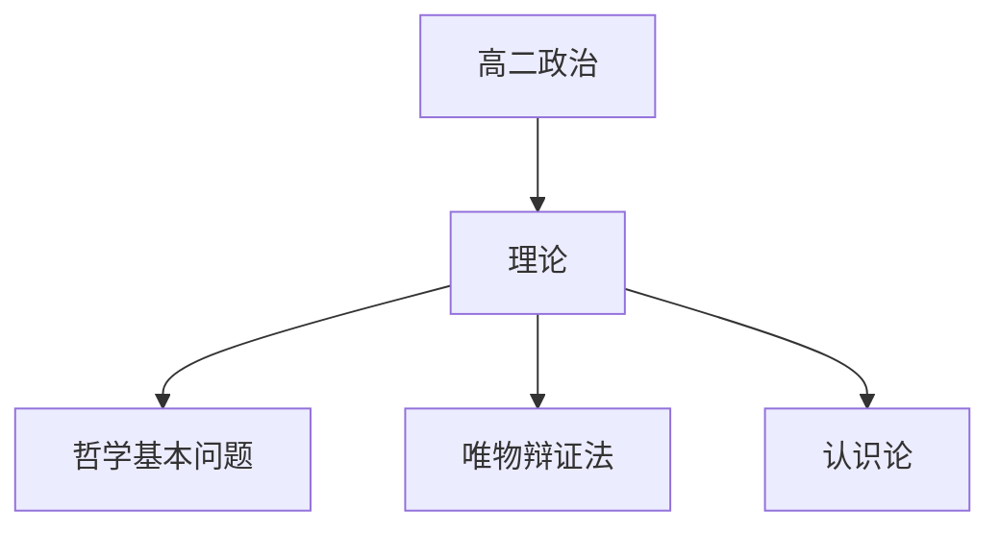

# 高二政治知识结构

## 知识体系总览

## 知识点列表

| 序号 | 知识点 | 核心目标 |
|------|--------|---------|
| 1 | [哲学基本问题](./哲学基本问题) | 理解唯物论辩证法和认识论 |
| 2 | [唯物辩证法](./唯物辩证法) | 掌握联系、发展、矛盾的观点 |
| 3 | [认识论与真理](./认识论与真理) | 理解实践是认识的基础，真理是具体的 |

## 学习目标

- 理解唯物论辩证法和认识论
- 掌握联系、发展、矛盾的观点
- 理解实践是认识的基础，真理是具体的
