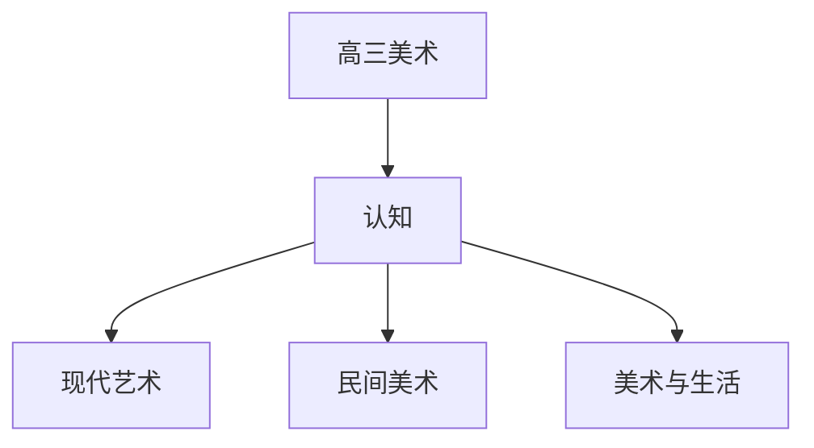

# 高三美术知识结构

## 知识体系总览

## 知识点列表

| 序号 | 知识点 | 核心目标 |
|------|--------|---------|
| 1 | [现代艺术](./现代艺术) | 了解现代主义到当代艺术的发展 |
| 2 | [中国民间美术](./中国民间美术) | 了解剪纸年画刺绣等民间美术 |
| 3 | [美术与生活](./美术与生活) | 探讨美术与日常生活环境的关系 |

## 学习目标

- 了解现代主义到当代艺术的发展
- 了解剪纸年画刺绣等民间美术
- 探讨美术与日常生活环境的关系
