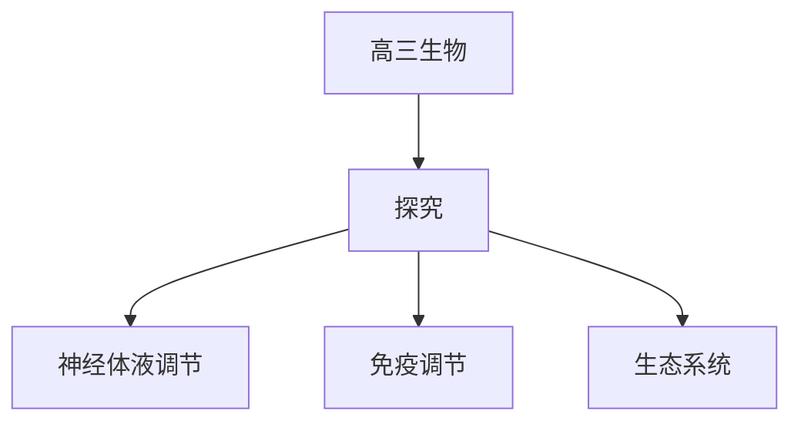

# 高三生物知识结构

## 知识体系总览

## 知识点列表

| 序号 | 知识点 | 核心目标 |
|------|--------|---------|
| 1 | [动物的神经-体液调节](./动物的神经-体液调节) | 理解神经调节和体液调节的机制 |
| 2 | [免疫调节](./免疫调节) | 了解免疫系统的组成和功能 |
| 3 | [生态系统与环境保护](./生态系统与环境保护) | 掌握生态系统的结构和功能，关注环境保护 |

## 学习目标

- 理解神经调节和体液调节的机制
- 了解免疫系统的组成和功能
- 掌握生态系统的结构和功能，关注环境保护
