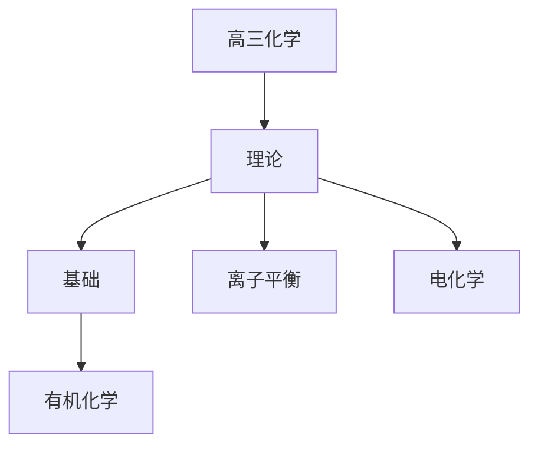

# 高三化学知识结构

## 知识体系总览

## 知识点列表

| 序号 | 知识点 | 核心目标 |
|------|--------|---------|
| 1 | [水溶液中的离子平衡](./水溶液中的离子平衡) | 掌握弱电解质的电离盐类水解和沉淀溶解平衡 |
| 2 | [电化学](./电化学) | 理解原电池和电解池原理 |
| 3 | [有机化学基础](./有机化学基础) | 了解烃和烃的衍生物的结构和性质 |

## 学习目标

- 掌握弱电解质的电离盐类水解和沉淀溶解平衡
- 理解原电池和电解池原理
- 了解烃和烃的衍生物的结构和性质
