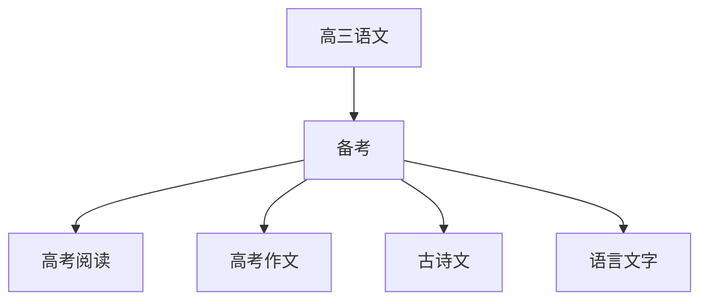

# 高三语文知识结构

## 知识体系总览

## 知识点列表

| 序号 | 知识点 | 核心目标 |
|------|--------|---------|
| 1 | [高考阅读综合](./高考阅读综合) | 论述类文学类实用类文本阅读综合训练 |
| 2 | [高考作文](./高考作文) | 材料作文审题立意和写作技巧 |
| 3 | [古诗文综合](./古诗文综合) | 古代诗歌鉴赏和文言文翻译综合训练 |
| 4 | [语言文字运用](./语言文字运用) | 成语病句衔接等语言运用综合训练 |

## 学习目标

- 论述类文学类实用类文本阅读综合训练
- 材料作文审题立意和写作技巧
- 古代诗歌鉴赏和文言文翻译综合训练
- 成语病句衔接等语言运用综合训练
