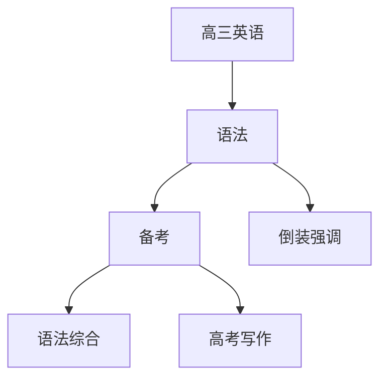

# 高三英语知识结构

## 知识体系总览

## 知识点列表

| 序号 | 知识点 | 核心目标 |
|------|--------|---------|
| 1 | [倒装与强调](./倒装与强调) | 掌握倒装句和强调句的结构 |
| 2 | [语法综合](./语法综合) | 高考语法填空和短文改错专项训练 |
| 3 | [高考写作](./高考写作) | 书信演讲稿看图写话等高考写作类型 |

## 学习目标

- 掌握倒装句和强调句的结构
- 高考语法填空和短文改错专项训练
- 书信演讲稿看图写话等高考写作类型
