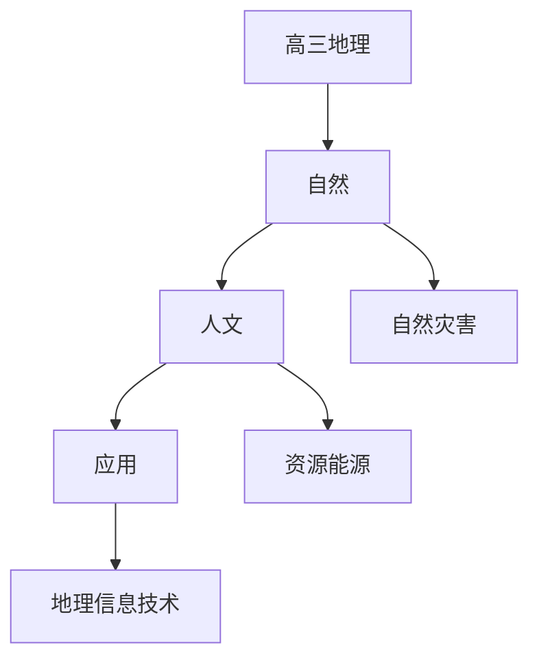

# 高三地理知识结构

## 知识体系总览

## 知识点列表

| 序号 | 知识点 | 核心目标 |
|------|--------|---------|
| 1 | [自然灾害与防治](./自然灾害与防治) | 了解主要自然灾害的成因和防治措施 |
| 2 | [资源与能源](./资源与能源) | 了解自然资源和能源的分布与利用 |
| 3 | [地理信息技术](./地理信息技术) | 了解遥感GPS和GIS的应用 |

## 学习目标

- 了解主要自然灾害的成因和防治措施
- 了解自然资源和能源的分布与利用
- 了解遥感GPS和GIS的应用
