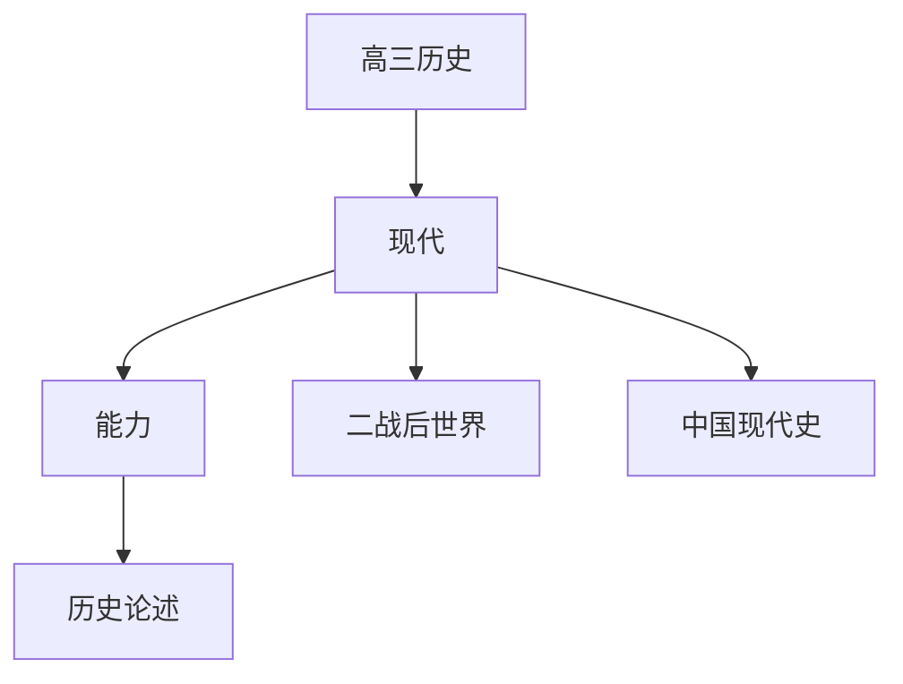

# 高三历史知识结构

## 知识体系总览

## 知识点列表

| 序号 | 知识点 | 核心目标 |
|------|--------|---------|
| 1 | [二战后的世界](./二战后的世界) | 了解冷战多极化趋势和经济全球化 |
| 2 | [中国现代史](./中国现代史) | 了解新中国建立社会主义建设和改革开放 |
| 3 | [历史综合论述](./历史综合论述) | 掌握历史小论文的写作方法 |

## 学习目标

- 了解冷战多极化趋势和经济全球化
- 了解新中国建立社会主义建设和改革开放
- 掌握历史小论文的写作方法
