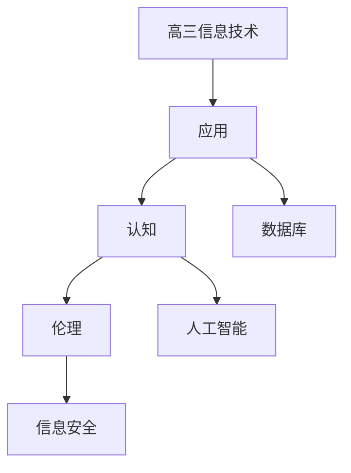

# 高三信息技术知识结构

## 知识体系总览

## 知识点列表

| 序号 | 知识点 | 核心目标 |
|------|--------|---------|
| 1 | [数据库基础](./数据库基础) | 了解数据库概念和基本SQL查询 |
| 2 | [人工智能初步](./人工智能初步) | 了解人工智能的基本概念和应用 |
| 3 | [信息安全与伦理](./信息安全与伦理) | 了解信息安全技术和信息伦理法规 |

## 学习目标

- 了解数据库概念和基本SQL查询
- 了解人工智能的基本概念和应用
- 了解信息安全技术和信息伦理法规
