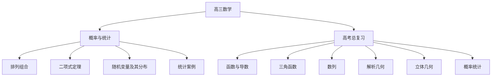

# 高三数学知识结构

## 知识体系总览

## 知识点列表

| 序号 | 知识点 | 核心目标 |
|------|--------|---------|
| 1 | [概率与统计](./概率与统计) | 掌握排列组合和概率分布 |
| 2 | [高考复习专题](./高考复习专题) | 系统复习，综合提升 |

## 学习目标

- 掌握排列组合和概率统计的基础知识
- 系统梳理高中数学知识体系
- 通过综合训练提升解题能力和应试技巧