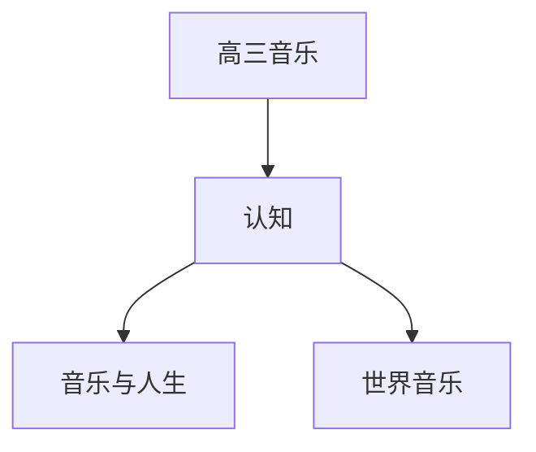

# 高三音乐知识结构

## 知识体系总览

## 知识点列表

| 序号 | 知识点 | 核心目标 |
|------|--------|---------|
| 1 | [音乐与人生](./音乐与人生) | 探讨音乐对人的成长和生活的意义 |
| 2 | [世界音乐](./世界音乐) | 了解世界各地代表性音乐文化 |

## 学习目标

- 探讨音乐对人的成长和生活的意义
- 了解世界各地代表性音乐文化
