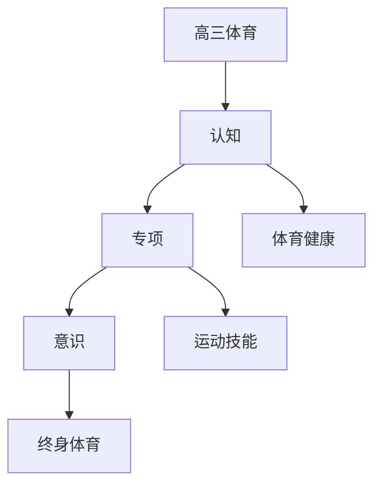

# 高三体育知识结构

## 知识体系总览

## 知识点列表

| 序号 | 知识点 | 核心目标 |
|------|--------|---------|
| 1 | [体育与健康](./体育与健康) | 了解体育锻炼对身心健康的促进作用 |
| 2 | [运动技能综合](./运动技能综合) | 选择1-2个项目进行专项提高 |
| 3 | [体育与终身体育](./体育与终身体育) | 培养终身体育意识和锻炼习惯 |

## 学习目标

- 了解体育锻炼对身心健康的促进作用
- 选择1-2个项目进行专项提高
- 培养终身体育意识和锻炼习惯
