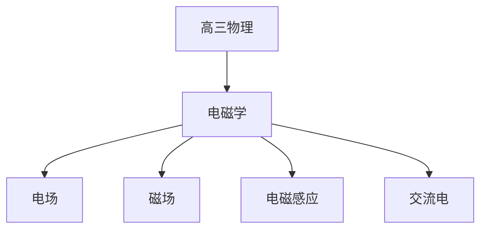

# 高三物理知识结构

## 知识体系总览

## 知识点列表

| 序号 | 知识点 | 核心目标 |
|------|--------|---------|
| 1 | [电场](./电场) | 掌握电场强度电势电势能电容器 |
| 2 | [磁场](./磁场) | 掌握安培力洛伦兹力带电粒子在磁场中的运动 |
| 3 | [电磁感应](./电磁感应) | 掌握法拉第电磁感应定律和楞次定律 |
| 4 | [交流电与传感器](./交流电与传感器) | 了解交变电流和传感器原理 |

## 学习目标

- 掌握电场强度电势电势能电容器
- 掌握安培力洛伦兹力带电粒子在磁场中的运动
- 掌握法拉第电磁感应定律和楞次定律
- 了解交变电流和传感器原理
