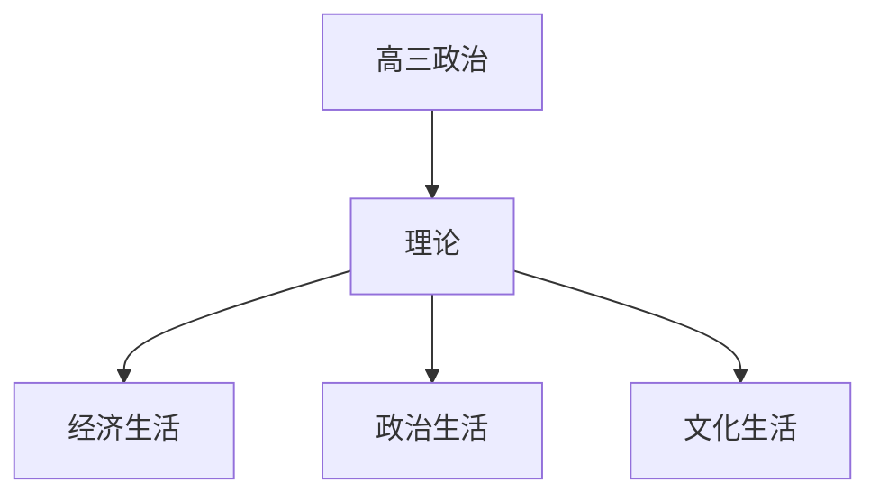

# 高三政治知识结构

## 知识体系总览

## 知识点列表

| 序号 | 知识点 | 核心目标 |
|------|--------|---------|
| 1 | [经济生活](./经济生活) | 了解生产消费分配交换的基本原理 |
| 2 | [政治生活](./政治生活) | 了解我国的政治制度和国家治理 |
| 3 | [文化生活](./文化生活) | 了解文化的继承发展和创新 |

## 学习目标

- 了解生产消费分配交换的基本原理
- 了解我国的政治制度和国家治理
- 了解文化的继承发展和创新
